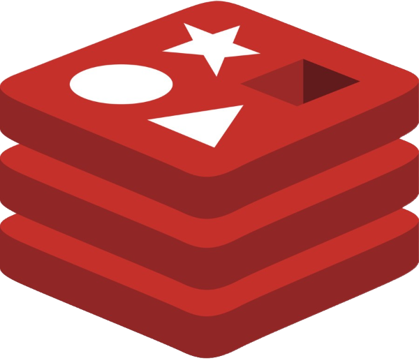
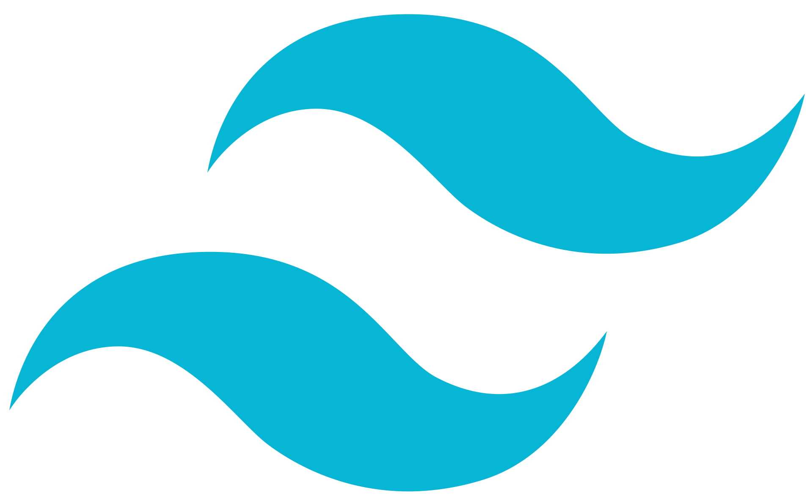
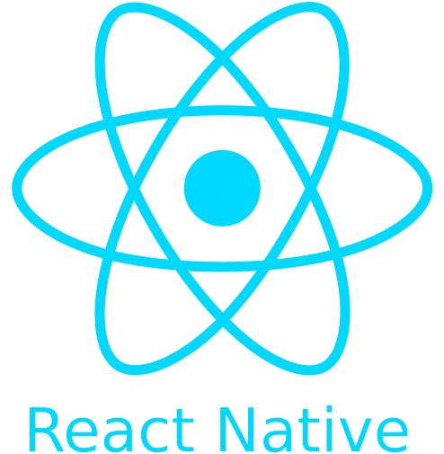
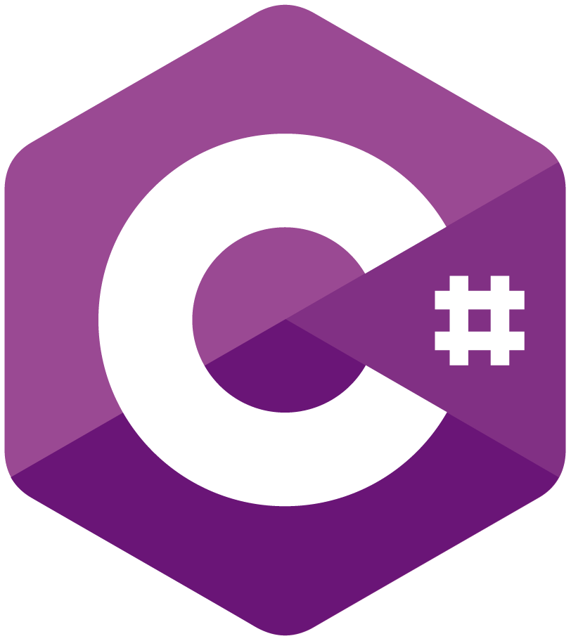
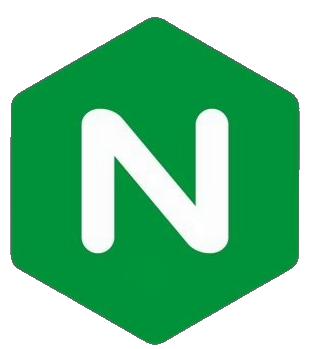
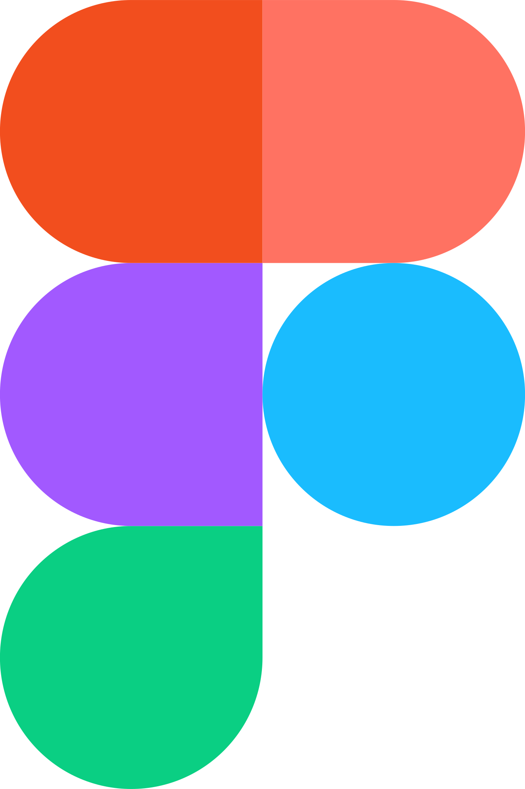
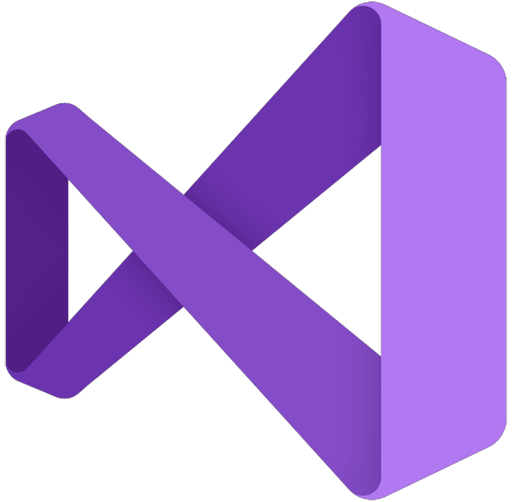

  

  

<!-- <h2>⚒️ Currently building Apps: ⚒️</h2> -->

<h1 align="center"> 📞 Connect with me 📞</h1>

<h1 align="center">⚙️ Tools & Technologies ⚙️</h1>

<h1 align="center">🎗️ My Profile Info 🎗️</h1>

    

 

<!--  https://github.com/anuraghazra/github-readme-stats/issues/2415  -->
    
    

 <!-- 

    

    
    

 -->

    

